# TechJournal
Проект представлет собой собой сайт, позволяющий пользователям просматривать новости, рассортированные по категориям и оставлять комментарии.
Архитектура веб-приложения состоит из трех основных компонентов:
- Клиент
- Сервер
- База данных

Для создания серверной части использовался Python и Django. Для создания API использовался Rest Framework. При разработке авторизации использовался JWT (JSON Web Token) и пакет Simple JWT.

Клиентская часть разработана с помощью библиотеки React. В качастве базы данных был использован Postgresql.

Для приложения был разработан файл Docker compose, который позволяет запустить все три основых компонента приложения в отдельных контейнерах. 
## Главная
При входе на сайт открывается главная страница со списком всех новостей и списком категорий.
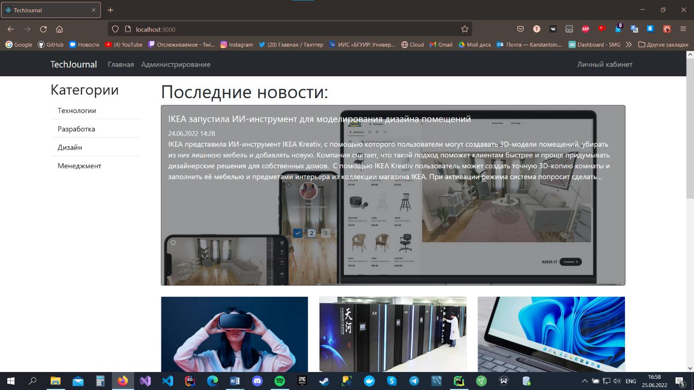
При нажатии на категорию в списке всех новостей отображаются новости, принадлежащие данной категории.
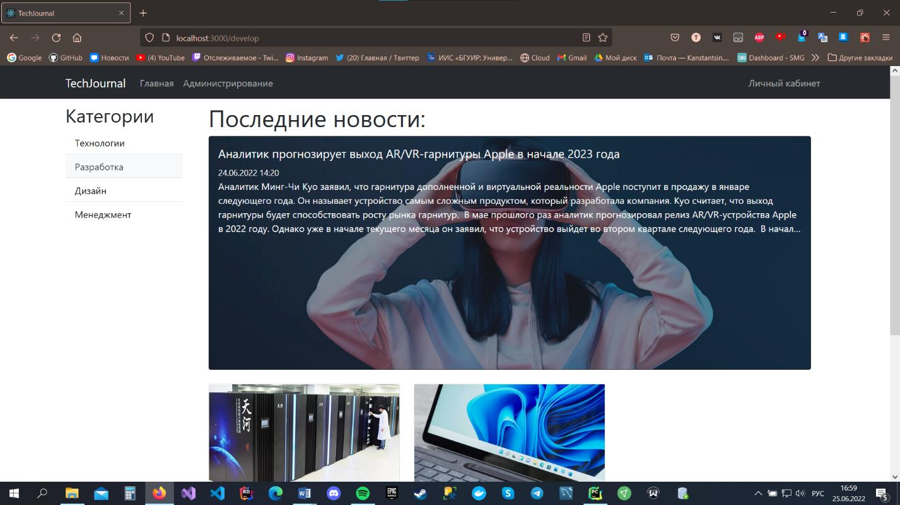
## Просмотр новости
При нажатии на новость отображается страница просмотра новости. На ней отображены изображение новости, текст новости и список комментариев
под новостью. Для того чтобы оставить комментарий требуется войти в аккаунт.
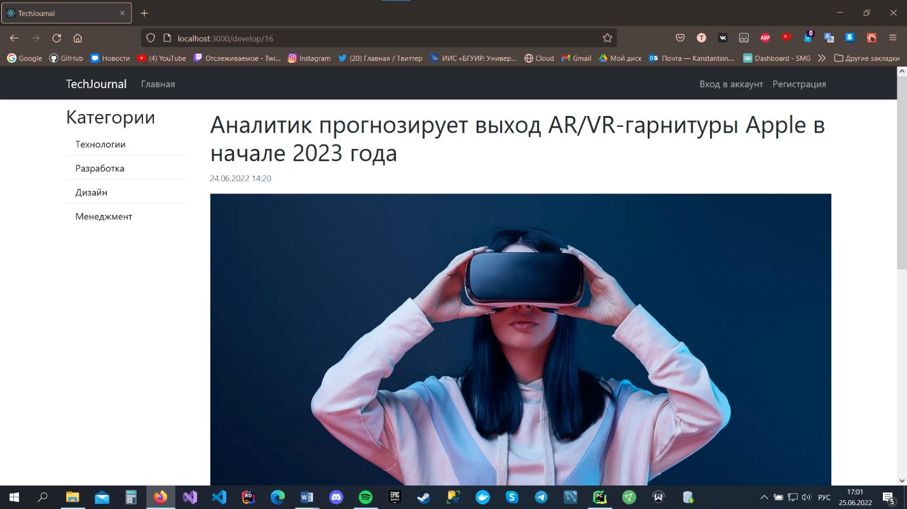
## Оставление комментария
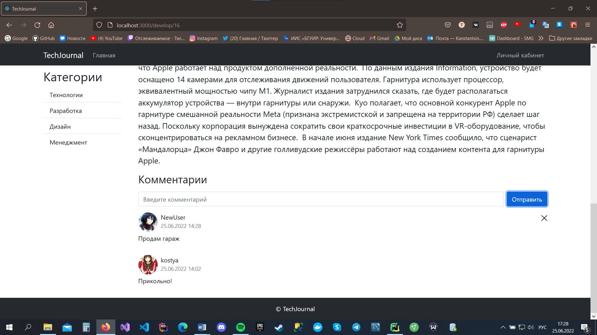
## Вход в аккаунт
На странице входа в аккаунт требуется ввести логин и пароль пользователя.
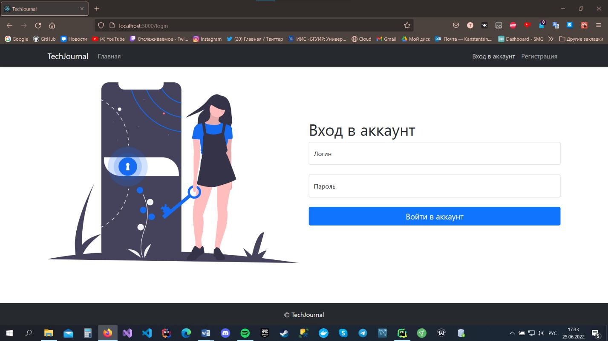
## Страница регистрации
Если у пользователя нет аккаунта, то требуется перейти на страницу регистрации где нужно ввести логин, email и пароль.
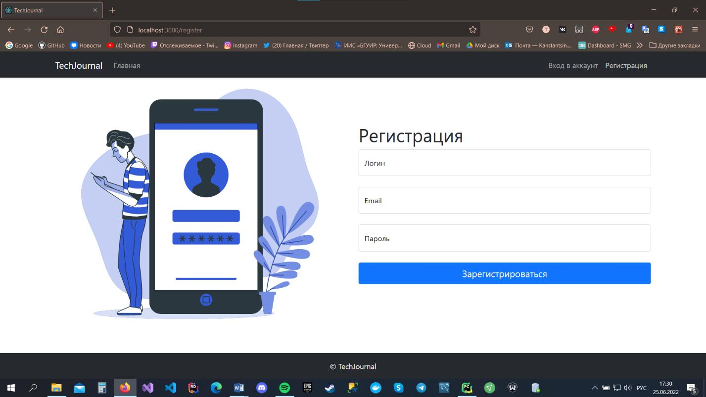
## Личный кабинет
После входа в аккаунт появляется доступ к личному кабинету пользователя. В личном кабинете можно изменить логин и email, а также загрузить
изображение пользователя.
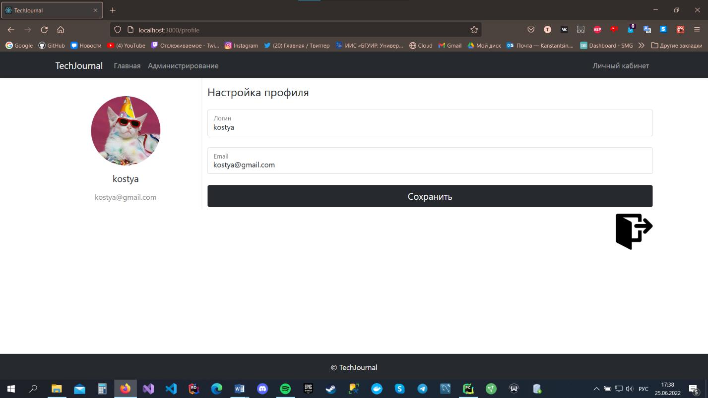
## Страница администрирования
Администратор имеет доступ к странице администрирования. На странице администрирования отображается список всех новостей, категорий и пользователей.
Также она позволяет редактировать, удалять и добавлять новости и категории. Администратор также может блокировать пользователей от входа в аккаунт.
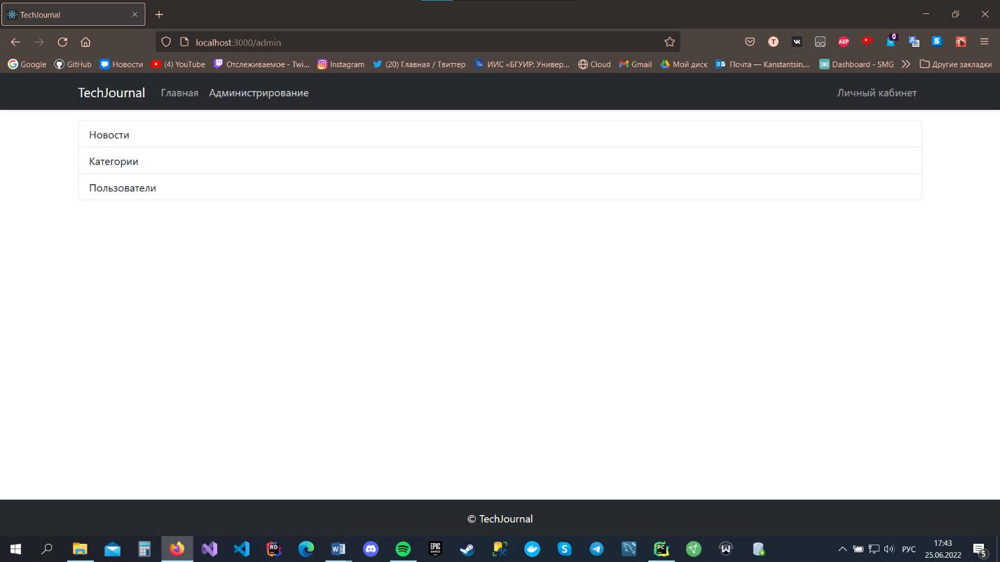
## Список новостей
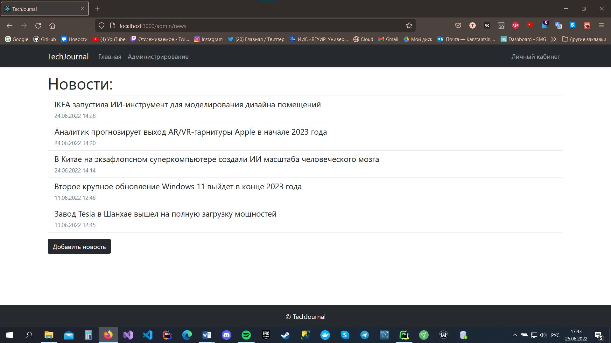
## Страница добавления и редактирования новости
На странице добавления или редактирования новости необходимо ввести заголовок новости, текст новости и выбрать категорию новости.
Также необходимо загрузить изображение новости.
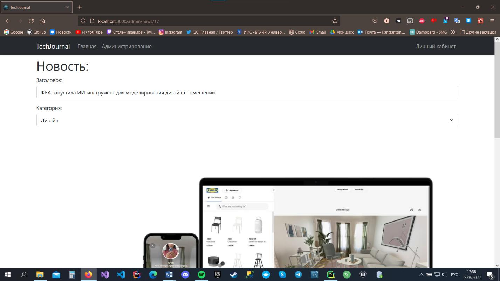

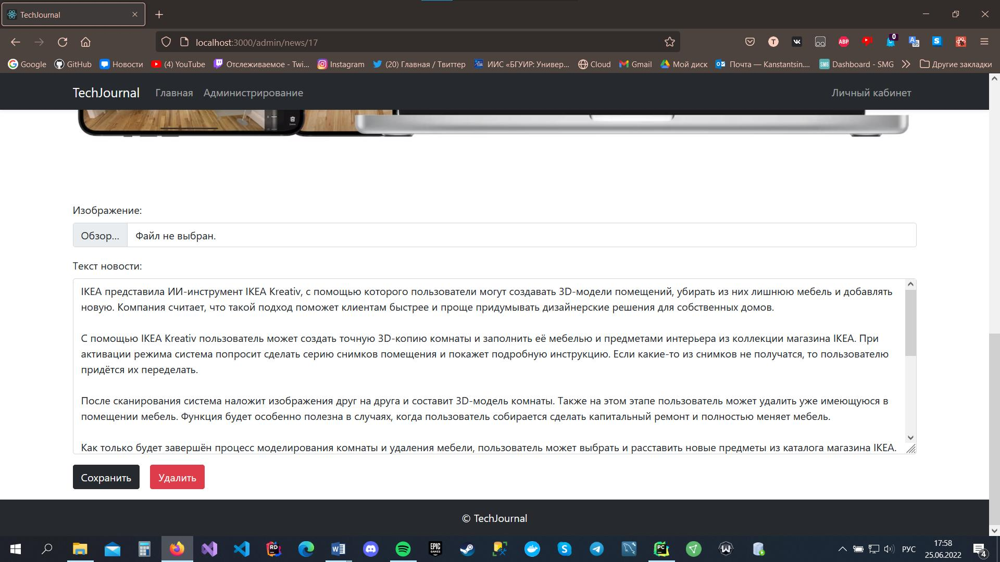
## Страница администрования пользователя
Страница редактирования пользователя позволяет администратору просматривать информацию о пользователе и блокировать
аккаунты пользователей.
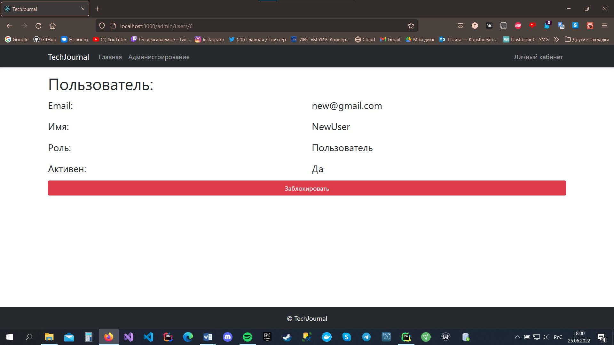
